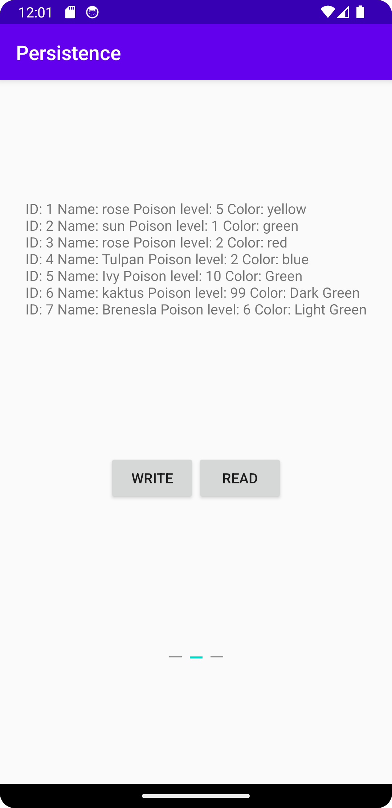

# Rapport

**Persistence**

Denna uppgift gick ut på att skapa en SQLite databas och sedan kunna skriva och läsa från den.

Två nya java filer lades till i deta projekt, dom filerna var DatabaseTables och DatabaseHelper.

I DatabaseTables bstämdes det hur databasen skule se ut och skapas.

DatabaseHelper hjälper till så att det går att interigera med databasen.

en text ruta, Två knappar som heter Read och Write och tre text fält lades till i activity_main.xml.

På write knappen sates det så när den tryks skrivs informatione in i text fälten 
till databasen. 
```
writeButton.setOnClickListener(new View.OnClickListener() {
    @Override
    public void onClick(View view) {
        ContentValues values = new ContentValues();
        values.put(DatabaseTables.Plant.COLUMN_NAME_NAME, nameAdd.getText().toString());
        values.put(DatabaseTables.Plant.COLUMN_NAME_POISONLEVEL, poisonLevelAdd.getText().toString());
        values.put(DatabaseTables.Plant.COLUMN_NAME_COLOR, colorAdd.getText().toString());
        database.insert(DatabaseTables.Plant.TABLE_NAME, null, values);
        nameAdd.setText("");
        poisonLevelAdd.setText("");
        colorAdd.setText("");
    }
});
```
På read knappen sates det så när den tryks hämtas informatione från databasen och säts i textviewn.

```
readButton.setOnClickListener(new View.OnClickListener() {
    @Override
    public void onClick(View view) {
        Cursor cursor = database.query(DatabaseTables.Plant.TABLE_NAME, null, null, null, null, null, null);
        ArrayList<String> plants = new ArrayList<>();

        while (cursor.moveToNext()) {
            plants.add("ID: " + cursor.getString(cursor.getColumnIndexOrThrow(DatabaseTables.Plant.COLUMN_NAME_ID)) +
                        " Name: " + cursor.getString(cursor.getColumnIndexOrThrow(DatabaseTables.Plant.COLUMN_NAME_NAME)) +
                        " Poison level: " +  cursor.getString(cursor.getColumnIndexOrThrow(DatabaseTables.Plant.COLUMN_NAME_POISONLEVEL)) +
                        " Color: " + cursor.getString(cursor.getColumnIndexOrThrow(DatabaseTables.Plant.COLUMN_NAME_COLOR)) + "\n");
        }
        String textPlants = "";
        for (String string : plants){
            textPlants  = textPlants + string;
        }
        readView.setText(textPlants);
        cursor.close();
    }
});
```

när data ska skrivas


när data har lästs


